# Documento de Visão do Projeto "Aplicativo de utilidades"

Este documento apresenta uma solução de software para o projeto Utilidade, solicitado pelo cliente Tomaz Mikio Sasaki, apresentando os problemas a serem solucionados, as necessidades dos principais envolvidos, o alcance do projeto e as funcionalidades esperadas do sistema.

## Objetivos

O sistema tem por objetivo integrar de forma inteligente qualquer pessoa que esteja precisando de algum tipo de serviço de utilidades em geral e o profissional a executar esta demanda, visando estreitar a comunicação entre contratante e contratado, garantir transparência durante todo o decorrer do processo, desde a escolha do profissional até a finalização do serviço prestado por este, e assegurar a qualidade do serviço prestado.

## Problema

* Descrição do problema: Necessidade de encontrar um profissional que presta serviços de utilidade e contratar alguém confiável. Da mesma forma, um profissional desta categoria, encontrar algum cliente.
* Quem é afetado pelo problema: Pessoas que de repente estejam precisando de algum serviço dentre os disponiveis no aplicativo.
* Impacto no negócio: Busca por um profissional, contratação, mão de obra, pagamento, indicação.
* Benefícios de uma boa solução: Praticidade, facilitador ao buscar o serviço desejado, ajuda a promover o trabalho do profissional.

## Definições, abreviações e outros termos do domínio do problema

* Serviços de utilidade: Chaveiro, encanador, eletricista, marceneiro, pedreiro, etc.
* Estreitar a comunicação: oferecer o serviço, negociar, planejar, monitorar execução dos serviços específicos, avisar ao cliente do andamento, controlar compras de materiais, emitir nota fiscal, controlar recebimentos e pagamentos, justificar avaliação. 
* Processo: Refere-se ao tempo cronológico de execução do serviço contratado, desde o momento da escolha do profissional até a interação final, a avaliação. 

## Integração com outros sistemas

* Google Maps API: O aplicativo terá integração com a API de mapas do Google para proporcionar uma melhor experiênci ao usuário, exibindo fornecedores próximos a ele. 

* Send grid API: Interface será utilizada para envio de confirmação de e-mail, quando um novo usuário/fornecedor se cadastra na plataforma.
 
## Interessados

* Gerente de projetos: Profissional que gere a equipe de desenvolvimento o andamento do projeto.
É responsável por gerir o fluxo de atividades, cronogramas, acompanhar tarefas da equipe de desenvolvimento, interação com demais frentes de trabalho  e suportar à dúvidas pontuais relacionadas ao projeto. 

* Fornecedores: Usuários que possuem serviços para divulgação no marketplace .  

* Público em geral: Usuários que terão acesso à plataforma para procurar fornecedores de acordo com a sua preferência. 

* Solicitante: Pessoa responsável pela requisição do projeto. É o cliente final da plataforma.

## Usuários

* Cliente: Quem necessita do serviço
. Cliente faz a escolha do tipo de serviço que precisa;
. Escolhe profissional;
. Acompanha  o andamento do serviço;
. Faz pagamento;
. Avalia profissional.

* Profissional: Aquele que oferece seu trabalho como forma de auxílio ao cliente. 
. Prestar serviço solicitado;
. Seguir cronograma;
. Ser pontual;
. Buscar excelência, visando boa avaliação. 

## Funcionalidades do produto

* Cadastro: Permite cadastrar na base de dados da aplicação clientes e profissionais.

* Busca: Permite que um cliente possa buscar um profissional que atenda sua necessidade em um serviço de utilidade, e permite que o profissional busque um cliente que necessite dos serviços que ele tem à oferecer.

* Contato: São informados dados do profissional para que possa ser feito contato entre ambas as partes.

* Monitoramento: Permite que o cliente monitore o contratado durante todo o processo de execução do seu trabalho.

* Pagamento: Formaliza o pagamento pelo serviço prestado.

* Avaliação: Funcionalidade onde o cliente pode atribuir uma nota ao profissional que lhe prestou serviço.

## Restrições do projeto

* Prazo: 6 meses.
* Sistema Operacional: Android, Windows.
* Hardware: smartphone.
* Permitir acessar câmera, imagens.
* Obrigatória conexão com internet para busca do profissional.
* Consultar acompanhamento poderá ser off-line.

## Protótipos de tela

### Protótipos para funcionalidade Cadastro

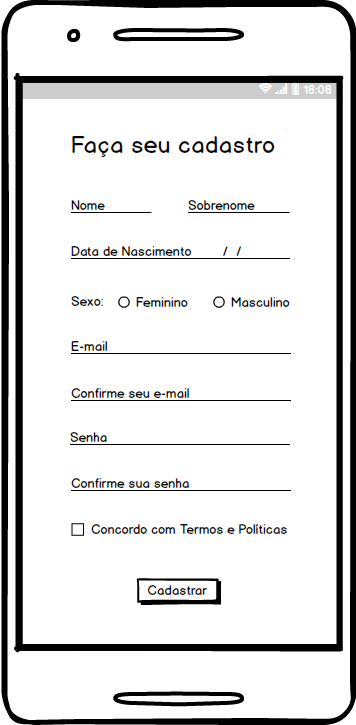
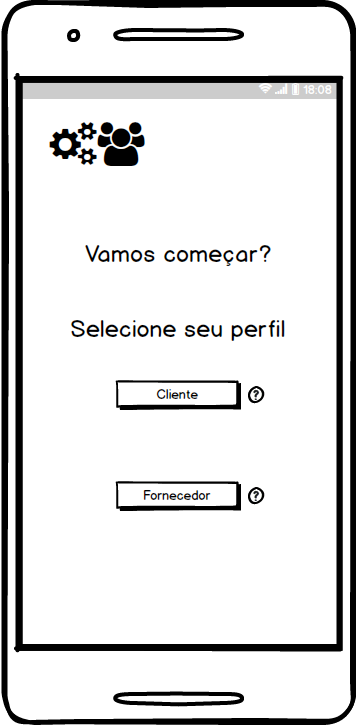
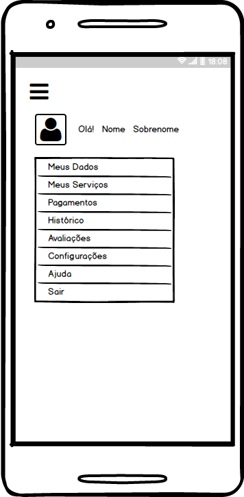

### Protótipos para funcionalidade Busca

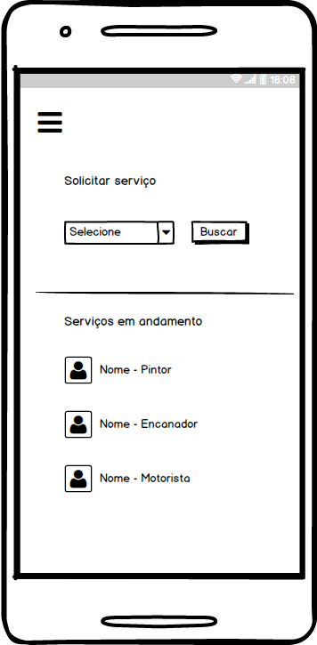
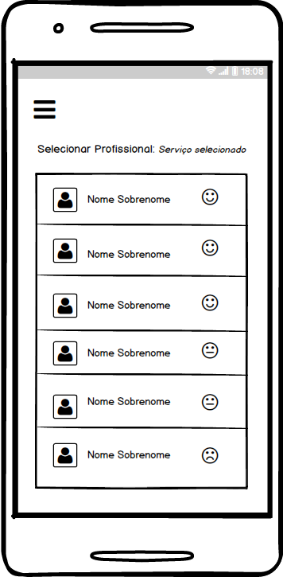

### Protótipos para funcionalidade Contato

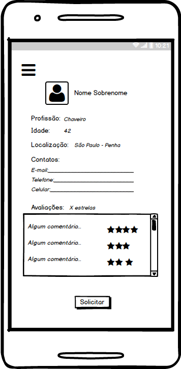

### Protótipos para funcionalidade Monitoramento

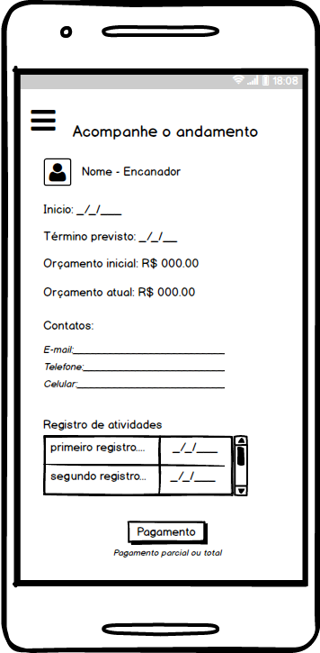
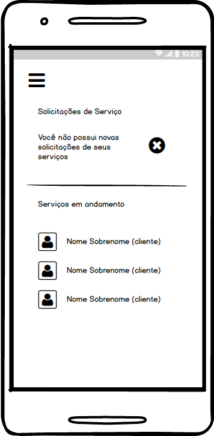
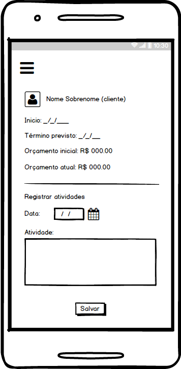

### Protótipos para funcionalidade Pagamento

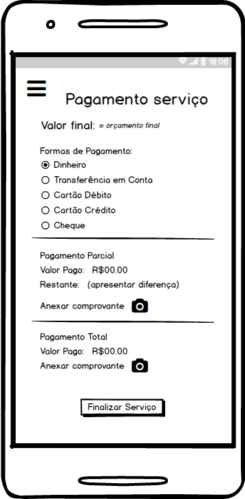
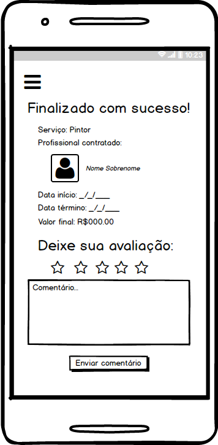
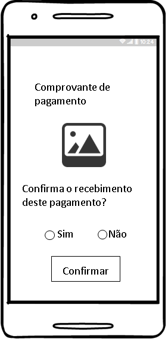
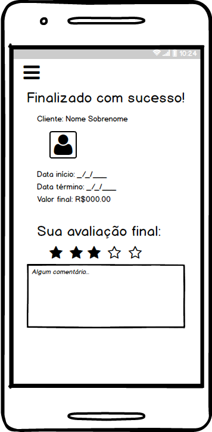

### Protótipos para funcionalidade Avaliação

