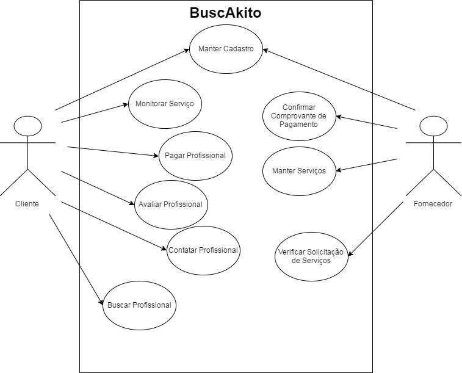

# Casos de uso

## 1. Diagrama de casos de uso

## 2. Especificação dos casos de uso

### 2.1. Caso de uso **MANTER CADASTRO**

| Campo          | Informação        |
|---|---|
| Identificador: | UC01              |
| Nome:          | Manter cadastro |
| Atores:        | Cliente/Fornecedor |
| Sumário:       | O usuário insere as informações para cadastro. Deve-se respeitar as regras de preenchimento dos campos. |

| Fluxo Principal |
|---|
| 1) O usuário informa os dados para cadastro, e seleciona todos os checkbox. |
| 2) O sistema valida os dados fornecidos e todos os checkbox. |
| 3) Sistema informa sucesso no cadastro, e redireciona para outra tela. Caso de uso é encerrado. |

| Fluxo Alternativo (2a): Os dados informados estão incorretos. |
|---|
| 1) O sistema informa que os dados estão incorretos ou os checkbox não estão selecionados. |
| 2) Enquanto o usuário não informar corretamente os dados e selecionar todos os checkbox, o sistema informa que os dados estão incorretos ou checkbox não estão selecionados. |
| 3) Usuário informa os dados corretamente e seleciona todos os checkbox. |
| 4) Volta ao passo 2 do fluxo principal. |

### 2.2. Caso de uso **BUSCAR PROFISSIONAL**

| Campo          | Informação        |
|---|---|
| Identificador: | UC02              |
| Nome:          | Buscar profissional |
| Atores:        | Cliente |
| Sumário:       | O cliente realiza a busca por um profissional, para realizar determinado serviço. |

| Fluxo Principal |
|---|
| 1) O usuário informa os dados para cadastro, e seleciona todos os checkbox. |
| 2) O sistema retorna uma lista com fornecedores do serviço buscado. |
| 3) Sistema redireciona para outra tela. Caso de uso é encerrado. |

| Fluxo Alternativo (2a): Os dados para busca estão vazios. |
|---|
| 1) O sistema informa que os dados da busca estão incorretos. |
| 2) Enquanto o usuário não informar corretamente os dados para busca, o sistema exibe mensagem de erro. |
| 3) Usuário informa os dados corretamente. |
| 4) Volta ao passo 1 do fluxo principal. |

### 2.3. Caso de uso **CONTRATAR PROFISSIONAL**

| Campo          | Informação        |
|---|---|
| Identificador: | UC03             |
| Nome:          | Contratar Profissional |
| Atores:        | Cliente |
| Sumário:       | O cliente solicita o fornecedor selecionado. |

| Fluxo Principal |
|---|
| 1) O cliente solicita o fornecedor. |
| 2) O sistema notifica o fornecedor. Caso de uso é encerrado. |

### 2.4. Caso de uso **MONITORAR SERVIÇO**

| Campo          | Informação        |
|---|---|
| Identificador: | UC04              |
| Nome:          | Monitorar serviço |
| Atores:        | Cliente |
| Sumário:       | O cliente verifica o andamento do serviço solicitado. |

| Fluxo Principal |
|---|
| 1) O cliente verifica andamento do serviço. |
| 2) O sistema redireciona para outra tela caso cliente deseja realizar o pagamento. Caso de uso é encerrado. |

| Fluxo Alternativo (2a): Os dados precism ser atualizados. |
|---|
| 1) O sistema redireciona para outra tela caso cliente deseja realizar o pagamento. Caso de uso é encerrado. |
| 2) Volta ao passo 1 do fluxo principal. |

### 2.5. Caso de uso **PAGAR PROFISSIONAL**

| Campo          | Informação        |
|---|---|
| Identificador: | UC05              |
| Nome:          | Pagar Profissional |
| Atores:        | Cliente |
| Sumário:       | O cliente informa forma de pagamento desejada e, se desejar, envia uma imagem do comprovante. |

| Fluxo Principal |
|---|
| 1) O cliente escolhe forma de pagamento. |
| 2) O sistema recupera dados do serviço. |
| 3) Cliente envia anexo se desejar. |
| 4) Sistema redireciona para outra tela. Caso de uso é encerrado. |

### 2.6. Caso de uso **AVALIAR PROFISSIONAL**

| Campo          | Informação        |
|---|---|
| Identificador: | UC06              |
| Nome:          | Avaliar Profissional |
| Atores:        | Cliente |
| Sumário:       | O cliente avalia serviço prestado pelo fornecedor contratado. |

| Fluxo Principal |
|---|
| 1) Sistema recupera dados do serviço contratado e informa na tela para o cliente. |
| 2) O cliente avalia o serviço prestado pelo fornecedor contratado. |
| 3) Sistema redireciona para outra tela. Caso de uso é encerrado. |

